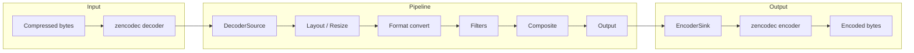
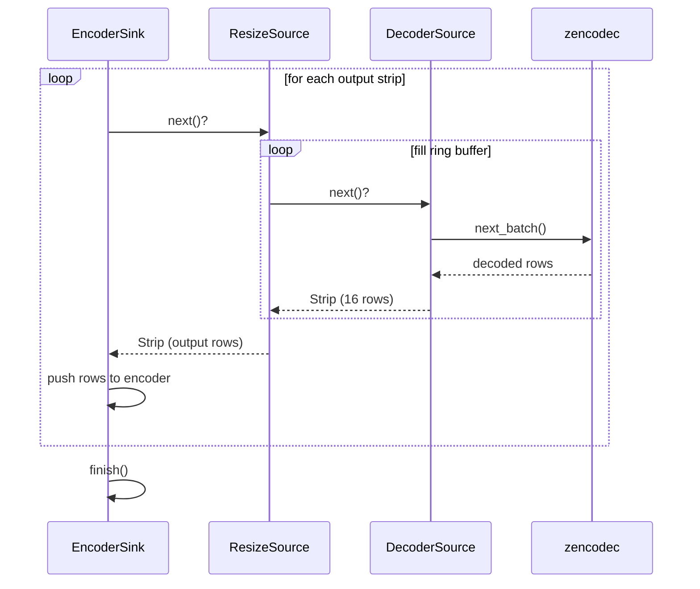
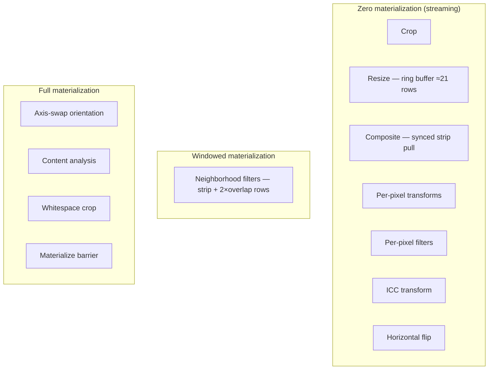
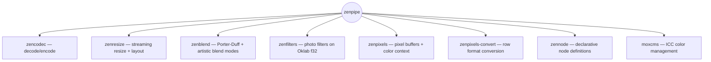
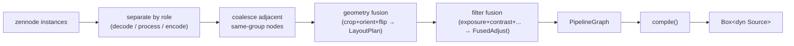

# zenpipe [](https://github.com/imazen/zenpipe/actions/workflows/ci.yml) [](https://doc.rust-lang.org/cargo/reference/manifest.html#the-rust-version-field) [](https://github.com/imazen/zenpipe#license)

Streaming pixel pipeline with zero-materialization execution. Pull-based DAG of
image operations — decode, resize, filter, composite, encode — with only the
rows needed for the current kernel in memory at any time.

## Architecture



### Pull model

The sink pulls strips from the output source. Each source pulls from its
upstream source on demand. Only the rows currently needed exist in memory.



### Memory model

Most operations stream — only resize ring buffers and neighborhood
filter windows allocate beyond the current strip.



## Pipeline graph

Build a DAG of operations, validate, estimate memory, compile to a
pull chain, execute.

```rust
let mut graph = PipelineGraph::new();
let src = graph.add_node(NodeOp::Source);
let resize = graph.add_node(NodeOp::Resize {
    w: 800, h: 600,
    filter: ResampleFilter::Robidoux,
    sharpen_percent: 0.0,
});
let out = graph.add_node(NodeOp::Output);

graph.add_edge(src, resize, EdgeKind::Input);
graph.add_edge(resize, out, EdgeKind::Input);

// Check resource budget before executing
let estimate = graph.estimate(&source_info)?;
estimate.check(&limits)?;

// Compile and execute
let mut sources = HashMap::new();
sources.insert(src, decoded_source);
let mut pipeline = graph.compile(sources)?;

let mut sink = EncoderSink::new(encoder, output_format);
zenpipe::execute(pipeline.as_mut(), &mut sink)?;
```

## Node types

```mermaid
graph TD
    NodeOp[NodeOp]

    NodeOp --> Sources[Sources]
    Sources --> Source["Source — external input"]

    NodeOp --> Geometry[Geometry]
    Geometry --> Layout["Layout — crop+orient+resize fused"]
    Geometry --> LayoutComposite["LayoutComposite — layout + background"]
    Geometry --> CropN["Crop"]
    Geometry --> ResizeN["Resize"]
    Geometry --> Constrain["Constrain — fit/within/exact"]
    Geometry --> ResizeAdv["ResizeAdvanced"]
    Geometry --> OrientN["Orient — EXIF 1-8"]
    Geometry --> AutoOrient["AutoOrient"]

    NodeOp --> PixelOps[Pixel operations]
    PixelOps --> Transform["PixelTransform — fusible per-pixel ops"]
    PixelOps --> FilterN["Filter — zenfilters pipeline"]
    PixelOps --> IccN["IccTransform — ICC profile conversion"]

    NodeOp --> Alpha[Alpha]
    Alpha --> RemoveAlpha["RemoveAlpha — composite on matte"]
    Alpha --> AddAlpha["AddAlpha — RGB → RGBA"]

    NodeOp --> CompOps[Compositing]
    CompOps --> CompositeN["Composite — Porter-Duff blend"]
    CompOps --> OverlayN["Overlay — watermark at offset"]

    NodeOp --> Barriers[Barriers]
    Barriers --> Materialize["Materialize — full-frame transform"]
    Barriers --> AnalyzeN["Analyze — content-adaptive"]
    Barriers --> CropWS["CropWhitespace"]

    NodeOp --> Terminal[Terminal]
    Terminal --> OutputN["Output"]
```



## Zen crate integration



| Crate | Role in pipeline |
|-------|-----------------|
| zencodec | DecoderSource wraps streaming decoder; EncoderSink wraps encoder |
| zenresize | Layout, Resize, Constrain nodes — streaming ring-buffer resize |
| zenblend | Composite node — blend modes on premultiplied linear f32 RGBA |
| zenfilters | Filter node — photo adjustments on Oklab f32 (per-pixel streams, neighborhood windows) |
| zenpixels | Strip type, ColorContext (ICC/CICP), metadata propagation |
| zenpixels-convert | Automatic row-level format conversion between nodes |
| zennode | Bridge: declarative node instances → PipelineGraph (optional) |
| moxcms | IccTransform node — row-by-row ICC profile conversion (optional) |

## Bridge layer (zennode → PipelineGraph)

When the `zennode` feature is enabled, declarative node definitions compile
into an executable pipeline graph with automatic fusion:



## Format conversion

Pixel format conversions happen automatically between nodes. Adjacent
PixelTransform nodes fuse into a single pass with ping-pong buffers.

Formats flow through the pipeline as `PixelDescriptor` values carrying
channel type (U8/U16/F32), layout (RGB/RGBA), alpha mode
(straight/premultiplied), transfer function (sRGB/linear/PQ/HLG),
and color primaries (BT.709/P3/BT.2020).

## Animation

Frame-by-frame processing for animated GIF/WebP/PNG:

1. Decode one composited frame
2. Process through per-frame pipeline (resize, filter, etc.)
3. Encode processed frame
4. Repeat

```rust
zenpipe::transcode(gif_decoder, webp_encoder, |frame_source, idx| {
    // Build per-frame pipeline, return compiled Source
})?;
```

## Resource estimation

```rust
let estimate = graph.estimate(&source_info)?;
println!("streaming: {} bytes", estimate.streaming_bytes);
println!("materialized: {} bytes", estimate.materialization_bytes);
println!("peak: {} bytes", estimate.peak_memory_bytes());

// Enforce limits before execution
estimate.check(&Limits {
    max_megapixels: Some(100),
    max_memory_bytes: Some(512 * 1024 * 1024),
    ..Default::default()
})?;
```

## Features

- `default = ["std"]` — enables zenfilters and moxcms
- `zennode` — bridge from declarative node definitions
- `nodes-all` — all codec node converters (jpeg, png, webp, gif, avif, jxl, tiff, bmp, resize, filters, etc.)
- `no_std + alloc` compatible for core pipeline

`#![forbid(unsafe_code)]` — pure safe Rust throughout.

## Image tech I maintain

| | |
|:--|:--|
| State of the art codecs* | [zenjpeg] · [zenpng] · [zenwebp] · [zengif] · [zenavif] ([rav1d-safe] · [zenrav1e] · [zenavif-parse] · [zenavif-serialize]) · [zenjxl] ([jxl-encoder] · [zenjxl-decoder]) · [zentiff] · [zenbitmaps] · [heic] · [zenraw] · [zenpdf] · [ultrahdr] · [mozjpeg-rs] · [webpx] |
| Compression | [zenflate] · [zenzop] |
| Processing | [zenresize] · [zenfilters] · [zenquant] · [zenblend] |
| Metrics | [zensim] · [fast-ssim2] · [butteraugli] · [resamplescope-rs] · [codec-eval] · [codec-corpus] |
| Pixel types & color | [zenpixels] · [zenpixels-convert] · [linear-srgb] · [garb] |
| Pipeline | **zenpipe** · [zencodec] · [zencodecs] · [zenlayout] · [zennode] |
| ImageResizer | [ImageResizer] (C#) — 24M+ NuGet downloads across all packages |
| [Imageflow][] | Image optimization engine (Rust) — [.NET][imageflow-dotnet] · [node][imageflow-node] · [go][imageflow-go] — 9M+ NuGet downloads across all packages |
| [Imageflow Server][] | [The fast, safe image server](https://www.imazen.io/) (Rust+C#) — 552K+ NuGet downloads, deployed by Fortune 500s and major brands |

<sub>* as of 2026</sub>

### General Rust awesomeness

[archmage] · [magetypes] · [enough] · [whereat] · [zenbench] · [cargo-copter]

[And other projects](https://www.imazen.io/open-source) · [GitHub @imazen](https://github.com/imazen) · [GitHub @lilith](https://github.com/lilith) · [lib.rs/~lilith](https://lib.rs/~lilith) · [NuGet](https://www.nuget.org/profiles/imazen) (over 30 million downloads / 87 packages)

## License

Dual-licensed: [AGPL-3.0](LICENSE-AGPL3) or [commercial](LICENSE-COMMERCIAL).

I've maintained and developed open-source image server software — and the 40+
library ecosystem it depends on — full-time since 2011. Fifteen years of
continual maintenance, backwards compatibility, support, and the (very rare)
security patch. That kind of stability requires sustainable funding, and
dual-licensing is how we make it work without venture capital or rug-pulls.
Support sustainable and secure software; swap patch tuesday for patch leap-year.

[Our open-source products](https://www.imazen.io/open-source)

**Your options:**

- **Startup license** — $1 if your company has under $1M revenue and fewer
  than 5 employees. [Get a key →](https://www.imazen.io/pricing)
- **Commercial subscription** — Governed by the Imazen Site-wide Subscription
  License v1.1 or later. Apache 2.0-like terms, no source-sharing requirement.
  Sliding scale by company size.
  [Pricing & 60-day free trial →](https://www.imazen.io/pricing)
- **AGPL v3** — Free and open. Share your source if you distribute.

See [LICENSE-COMMERCIAL](LICENSE-COMMERCIAL) for details.

[zenjpeg]: https://github.com/imazen/zenjpeg
[zenpng]: https://github.com/imazen/zenpng
[zenwebp]: https://github.com/imazen/zenwebp
[zengif]: https://github.com/imazen/zengif
[zenavif]: https://github.com/imazen/zenavif
[zenjxl]: https://github.com/imazen/zenjxl
[zentiff]: https://github.com/imazen/zentiff
[zenbitmaps]: https://github.com/imazen/zenbitmaps
[heic]: https://github.com/imazen/heic-decoder-rs
[zenraw]: https://github.com/imazen/zenraw
[zenpdf]: https://github.com/imazen/zenpdf
[ultrahdr]: https://github.com/imazen/ultrahdr
[jxl-encoder]: https://github.com/imazen/jxl-encoder
[zenjxl-decoder]: https://github.com/imazen/zenjxl-decoder
[rav1d-safe]: https://github.com/imazen/rav1d-safe
[zenrav1e]: https://github.com/imazen/zenrav1e
[mozjpeg-rs]: https://github.com/imazen/mozjpeg-rs
[zenavif-parse]: https://github.com/imazen/zenavif-parse
[zenavif-serialize]: https://github.com/imazen/zenavif-serialize
[webpx]: https://github.com/imazen/webpx
[zenflate]: https://github.com/imazen/zenflate
[zenzop]: https://github.com/imazen/zenzop
[zenresize]: https://github.com/imazen/zenresize
[zenfilters]: https://github.com/imazen/zenfilters
[zenquant]: https://github.com/imazen/zenquant
[zenblend]: https://github.com/imazen/zenblend
[zensim]: https://github.com/imazen/zensim
[fast-ssim2]: https://github.com/imazen/fast-ssim2
[butteraugli]: https://github.com/imazen/butteraugli
[zenpixels]: https://github.com/imazen/zenpixels
[zenpixels-convert]: https://github.com/imazen/zenpixels
[linear-srgb]: https://github.com/imazen/linear-srgb
[garb]: https://github.com/imazen/garb
[zencodec]: https://github.com/imazen/zencodec
[zencodecs]: https://github.com/imazen/zencodecs
[zenlayout]: https://github.com/imazen/zenlayout
[zennode]: https://github.com/imazen/zennode
[Imageflow]: https://github.com/imazen/imageflow
[Imageflow Server]: https://github.com/imazen/imageflow-server
[imageflow-dotnet]: https://github.com/imazen/imageflow-dotnet
[imageflow-node]: https://github.com/imazen/imageflow-node
[imageflow-go]: https://github.com/imazen/imageflow-go
[ImageResizer]: https://github.com/imazen/resizer
[archmage]: https://github.com/imazen/archmage
[magetypes]: https://github.com/imazen/archmage
[enough]: https://github.com/imazen/enough
[whereat]: https://github.com/lilith/whereat
[zenbench]: https://github.com/imazen/zenbench
[cargo-copter]: https://github.com/imazen/cargo-copter
[resamplescope-rs]: https://github.com/imazen/resamplescope-rs
[codec-eval]: https://github.com/imazen/codec-eval
[codec-corpus]: https://github.com/imazen/codec-corpus
