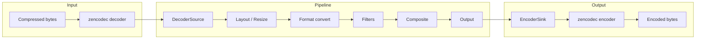
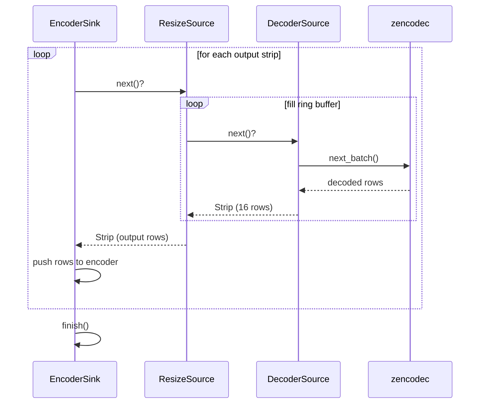
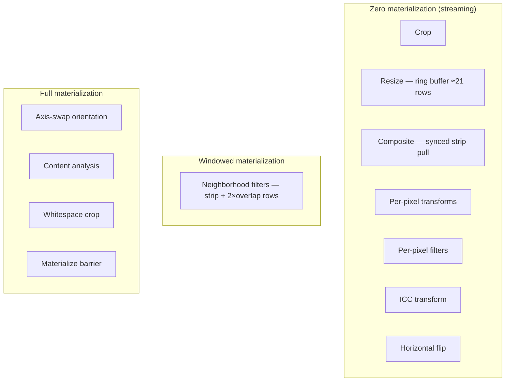
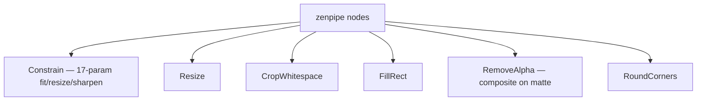
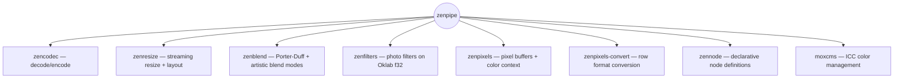
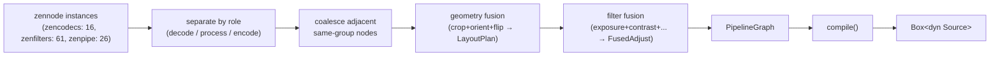

# zenpipe [](https://github.com/imazen/zenpipe/actions/workflows/ci.yml) [](https://crates.io/crates/zenpipe) [](https://lib.rs/crates/zenpipe) [](https://docs.rs/zenpipe) [](https://doc.rust-lang.org/cargo/reference/manifest.html#the-rust-version-field) [](#license)

Streaming pixel pipeline with zero-materialization execution. A pull-based DAG of
image operations — decode, resize, filter, composite, encode — that keeps only the
rows the current kernel needs in memory at any moment. Pure Rust,
`#![forbid(unsafe_code)]`, `no_std + alloc` for the core pipeline.

This is the canonical monorepo for the zenpipe pipeline plus the
[`zencodecs`](https://github.com/imazen/zenpipe/tree/main/zencodecs),
[`zenfilters`](https://github.com/imazen/zenpipe/tree/main/zenfilters), and
[`zenlayout`](https://github.com/imazen/zenpipe/tree/main/zenlayout)
member crates (whose standalone repositories now redirect here).

## Quick start

```toml
[dependencies]
# High-level bytes-in -> bytes-out job API + JPEG decode / WebP encode:
zenpipe = { version = "0.1.0", features = ["job", "nodes-jpeg", "nodes-webp"] }
```

[`ImageJob`](https://docs.rs/zenpipe/latest/zenpipe/job/struct.ImageJob.html) is the
high-level path: hand it input bytes, optional processing nodes, and an encode
intent, and it runs the whole **probe → decode → CMS → pipeline → encode** chain.

```rust,ignore
use zenpipe::job::ImageJob;
use zencodecs::CodecIntent;

let jpeg_bytes: Vec<u8> = std::fs::read("photo.jpg")?;

let result = ImageJob::new()
    .add_input(0, jpeg_bytes)             // input slot 0
    .add_output(1)                         // output slot 1 receives encoded bytes
    // .with_nodes(&nodes)                 // optional: resize / filter / composite nodes
    .with_intent(CodecIntent::default())   // target format + quality intent
    .run()?;

let encoded = &result.encode_results[0];
println!("encoded {} bytes ({})", encoded.bytes.len(), encoded.mime_type);
# Ok::<(), whereat::At<zenpipe::PipeError>>(())
```

For fine-grained control, build a [`PipelineGraph`](#pipeline-graph) and drive it
with [`zenpipe::execute`](https://docs.rs/zenpipe/latest/zenpipe/fn.execute.html)
(or `execute_with_stop` for cooperative cancellation) over the `Source`/`Sink`
traits — see below.

<!-- crates.io:skip-start -->
## Architecture


```mermaid
graph LR
    subgraph Input
        A[Compressed bytes] --> B[zencodec decoder]
    end
    subgraph Pipeline
        B --> C[DecoderSource]
        C --> D[Layout / Resize]
        D --> E[Format convert]
        E --> F[Filters]
        F --> G[Composite]
        G --> H[Output]
    end
    subgraph Output
        H --> I[EncoderSink]
        I --> J[zencodec encoder]
        J --> K[Encoded bytes]
    end
```

### Pull model

The sink pulls strips from the output source. Each source pulls from its
upstream source on demand. Only the rows currently needed exist in memory.


```mermaid
sequenceDiagram
    participant Sink as EncoderSink
    participant Resize as ResizeSource
    participant Decode as DecoderSource
    participant Codec as zencodec

    loop for each output strip
        Sink->>Resize: next()?
        loop fill ring buffer
            Resize->>Decode: next()?
            Decode->>Codec: next_batch()
            Codec-->>Decode: decoded rows
            Decode-->>Resize: Strip (16 rows)
        end
        Resize-->>Sink: Strip (output rows)
        Sink->>Sink: push rows to encoder
    end
    Sink->>Sink: finish()
```

### Memory model

Most operations stream — only resize ring buffers and neighborhood
filter windows allocate beyond the current strip.


```mermaid
graph TD
    subgraph "Zero materialization (streaming)"
        Crop[Crop]
        Resize[Resize — ring buffer ≈21 rows]
        Composite[Composite — synced strip pull]
        PixelOps[Per-pixel transforms]
        Filters[Per-pixel filters]
        ICC[ICC transform]
        Flip[Horizontal flip]
    end
    subgraph "Windowed materialization"
        Blur[Neighborhood filters — strip + 2×overlap rows]
    end
    subgraph "Full materialization"
        Orient[Axis-swap orientation]
        Analyze[Content analysis]
        CropWS[Whitespace crop]
        Custom[Materialize barrier]
    end
```
<!-- crates.io:skip-end -->

## Pipeline graph

Build a DAG of operations, validate, estimate memory, compile to a
pull chain, execute.

```rust,ignore
use zenpipe::graph::{PipelineGraph, NodeOp, EdgeKind};
use zenpipe::codec::EncoderSink;

let mut graph = PipelineGraph::new();
let src = graph.add_node(NodeOp::Source);
let resize = graph.add_node(NodeOp::Resize {
    w: 800,
    h: 600,
    filter: Some(zenresize::Filter::Robidoux),
    sharpen_percent: None,
});
let out = graph.add_node(NodeOp::Output);

graph.add_edge(src, resize, EdgeKind::Input);
graph.add_edge(resize, out, EdgeKind::Input);

// Check the resource budget before executing
let estimate = graph.estimate(&source_info)?;
estimate.check(&limits)?;

// Compile (NodeId -> decoded Source) and execute into an encoder sink
let mut sources = hashbrown::HashMap::new();
sources.insert(src, decoded_source);
let mut pipeline = graph.compile(sources)?;

let mut sink = EncoderSink::new(encoder, output_format);
zenpipe::execute(pipeline.as_mut(), &mut sink)?;
```

## Node types

Node definitions are distributed across crates. Each crate owns the nodes
for its domain; `full_registry()` aggregates them all.

| Owner | Nodes | Count |
|-------|-------|------:|
| **zenpipe** | Geometry + layout (crop/orient/flip/rotate/region/expand-canvas), Constrain, Resize, CropWhitespace, SmartCrop, FillRect, RemoveAlpha, RoundCorners, Composite, Overlay + RIAPI adapters | 26 |
| **zencodecs** | JPEG/PNG/WebP/GIF/AVIF/JXL/TIFF/BMP/HEIC encode+decode, Quantize, QualityIntentNode | 16 |
| **zenfilters** | Photo adjustment filter nodes | 61 |

<!-- crates.io:skip-start -->
### zenpipe-owned nodes


```mermaid
graph TD
    zenpipe[zenpipe nodes]

    zenpipe --> Constrain["Constrain — 17-param fit/resize/sharpen"]
    zenpipe --> ResizeN["Resize"]
    zenpipe --> CropWS["CropWhitespace"]
    zenpipe --> FillRect["FillRect"]
    zenpipe --> RemoveAlpha["RemoveAlpha — composite on matte"]
    zenpipe --> RoundCorners["RoundCorners"]
```
<!-- crates.io:skip-end -->

### Constrain node

The Constrain node is the primary geometry entry point with 17 parameters:

- **Dimensions** — `w`, `h`
- **Layout** — `mode` (10 modes including `LargerThan`), `gravity`, `canvas_color`, `matte_color`
- **Resampling** — separate `down_filter` and `up_filter` (31 filter variants, selected by net area change)
- **Post-processing** — `unsharp_percent`, `post_blur` (real cost)
- **Kernel shape** — `kernel_lobe_ratio`, `kernel_width_scale` (zero cost)
- **Scaling colorspace** — linear or sRGB
- **Conditional execution** — `resample_when`, `sharpen_when`

## Zen crate integration

<!-- crates.io:skip-start -->

```mermaid
graph TB
    zenpipe((zenpipe))

    zencodec[zencodec — decode/encode]
    zenresize[zenresize — streaming resize + layout]
    zenblend[zenblend — Porter-Duff + artistic blend modes]
    zenfilters[zenfilters — photo filters on Oklab f32]
    zenpixels[zenpixels — pixel buffers + color context]
    zenpixels_convert[zenpixels-convert — row format conversion]
    zennode[zennode — declarative node definitions]
    moxcms[moxcms — ICC color management]

    zenpipe --> zencodec
    zenpipe --> zenresize
    zenpipe --> zenblend
    zenpipe --> zenfilters
    zenpipe --> zenpixels
    zenpipe --> zenpixels_convert
    zenpipe --> zennode
    zenpipe --> moxcms
```
<!-- crates.io:skip-end -->

| Crate | Role in pipeline |
|-------|-----------------|
| zencodec | DecoderSource wraps streaming decoder; EncoderSink wraps encoder |
| zenresize | Layout, Resize, Constrain nodes — streaming ring-buffer resize |
| zenblend | Composite node — blend modes on premultiplied linear f32 RGBA |
| zenfilters | Filter node — photo adjustments on Oklab f32 (per-pixel streams, neighborhood windows) |
| zenpixels | Strip type, ColorContext (ICC/CICP), metadata propagation |
| zenpixels-convert | Automatic row-level format conversion between nodes |
| zennode | Bridge: declarative node instances → PipelineGraph; node definitions owned by zencodecs (16), zenfilters (61), and zenpipe (26); `full_registry()` aggregates all three |
| moxcms | IccTransform node — row-by-row ICC profile conversion (optional) |

## Bridge layer (zennode → PipelineGraph)

When the `zennode` feature is enabled, declarative node definitions compile
into an executable pipeline graph with automatic fusion. Node definitions
are distributed: zencodecs owns 16 codec/quantize/quality-intent nodes,
zenfilters owns 61 filter nodes, and zenpipe owns 26 geometry/resize/pipeline/RIAPI-adapter
nodes (Constrain, Resize, CropWhitespace, FillRect, RemoveAlpha,
RoundCorners). Call `full_registry()` to aggregate all three.

<!-- crates.io:skip-start -->

```mermaid
flowchart LR
    A["zennode instances
    (zencodecs: 16, zenfilters: 61, zenpipe: 26)"] --> B["separate by role
    (decode / process / encode)"]
    B --> C["coalesce adjacent
    same-group nodes"]
    C --> D["geometry fusion
    (crop+orient+flip → LayoutPlan)"]
    D --> E["filter fusion
    (exposure+contrast+... → FusedAdjust)"]
    E --> F["PipelineGraph"]
    F --> G["compile()"]
    G --> H["Box&lt;dyn Source&gt;"]
```
<!-- crates.io:skip-end -->

## Format conversion

Pixel format conversions happen automatically between nodes. Adjacent
PixelTransform nodes fuse into a single pass with ping-pong buffers.

Formats flow through the pipeline as `PixelDescriptor` values carrying
channel type (U8/U16/F32), layout (RGB/RGBA), alpha mode
(straight/premultiplied), transfer function (sRGB/linear/PQ/HLG),
and color primaries (BT.709/P3/BT.2020).

## Animation

Frame-by-frame processing for animated GIF/WebP/PNG, via
[`zenpipe::animation::transcode`](https://docs.rs/zenpipe/latest/zenpipe/animation/fn.transcode.html):

1. Decode one composited frame
2. Process through a per-frame pipeline (resize, filter, etc.)
3. Encode the processed frame
4. Repeat

```rust,ignore
use zenpipe::animation::transcode;

let output = transcode(
    gif_decoder,          // Box<dyn DynAnimationFrameDecoder>
    webp_encoder,         // Box<dyn DynAnimationFrameEncoder>
    out_width,
    out_height,
    out_format,           // PixelFormat
    |frame_source, _idx| {
        // Build a per-frame pipeline, return the compiled Source
        Ok(frame_source)
    },
)?;
```

`transcode_with_stop` and `transcode_with_stop_and_limits` add cooperative
cancellation and resource limits.

## Resource estimation

```rust,ignore
let estimate = graph.estimate(&source_info)?;
println!("streaming: {} bytes", estimate.streaming_bytes);
println!("materialized: {} bytes", estimate.materialization_bytes);
println!("peak: {} bytes", estimate.peak_memory_bytes());

// Enforce limits before execution
estimate.check(&Limits {
    max_pixels: Some(120_000_000), // 120 MP — admits 108 MP phone photos
    max_memory_bytes: Some(512 * 1024 * 1024),
    ..Default::default()
})?;
```

## Incremental re-render (`Session`)

For editors that re-run the same pipeline with tweaked downstream nodes,
`Session` (feature `zennode`) caches the post-geometry pixels and resumes from
them. Node lists are hashed as a Merkle chain (source identity → each node's
schema + params), so only an unchanged prefix hits; a partial hit re-runs just
the appended geometry nodes from the cached pixels.

```rust,ignore
use zenpipe::Session;

let mut session = Session::new(64 * 1024 * 1024); // byte budget, LRU-evicted
let source_hash = hash_of(path, mtime, size);      // caller-owned identity

// Full render: decode + geometry run, post-geometry pixels are cached.
let out = session.stream(decode(path)?, &config_exposure_0_5, None, source_hash)?;

// Slider moved: same source + geometry → decoder dropped unread, only the
// filter + encode nodes execute. `config.limits` is enforced on every run.
let out = session.stream(decode(path)?, &config_exposure_1_0, None, source_hash)?;
```

## Smart crop (`c.focus`)

zenpipe supports content-aware cropping via the `c.focus` RIAPI parameter, back-compatible with ImageResizer's CropAround plugin.

```text
?w=800&h=600&mode=crop&c.focus=20,30,80,90          # keep this region visible
?w=400&h=400&mode=crop&c.focus=50,30                 # focal point (like c.gravity)
?w=800&h=600&mode=crop&c.focus=20,30,80,90&c.zoom=true  # tight crop around region
?w=800&h=600&mode=crop&c.focus=faces                 # face detection (when available)
```

| Parameter | Effect |
|-----------|--------|
| `c.focus=x1,y1,x2,y2` | Focus rect in percentages (0-100). Crop shifts to keep it visible. |
| `c.focus=x1,y1,x2,y2;x3,y3,x4,y4` | Multiple rects (semicolon or flat comma groups). |
| `c.focus=x,y` | Focal point — sets crop gravity. |
| `c.focus=faces\|saliency\|auto` | Detection keywords — silently ignored without `nodes-faces` feature. |
| `c.zoom=true` | Maximal (tight) crop. Default `false` = minimal (loose). |
| `c.finalmode=pad\|crop\|max` | Override constraint mode after smart crop. |

Manual focus rects work with zero additional dependencies — just zenlayout geometry. The detection keywords (`faces`, `saliency`, `auto`) activate when the `nodes-faces` feature is enabled, bringing in zensally for ML-based face detection and saliency maps.

## Features

- `default = ["std", "lossless-jpeg"]` — `std` enables zenfilters + moxcms ICC CMS; `lossless-jpeg` is a fast orient-only JPEG path
- `job` — high-level bytes-in/bytes-out [`ImageJob`] API (implies `zennode` + `std`)
- `zennode` — bridge from declarative node definitions into `PipelineGraph`
- `nodes-all` — all codec node converters (jpeg, png, webp, gif, avif, jxl, tiff, bmp, heic, resize, filters, quant)
- `nodes-faces` — face detection + saliency via zensally (optional, adds ML models)
- `json-schema` — JSON Schema / OpenAPI export from the node registry
- `imageflow-compat` — translate Imageflow v2 jobs into zen pipelines

The core pipeline (resize, blend, codec bridge, animation, format conversion,
limits) builds in a `no_std + alloc` environment without `std`.
`#![forbid(unsafe_code)]` — pure safe Rust throughout.

## Crates in this repo

| Crate | What it does |
|-------|--------------|
| [`zenpipe`](https://crates.io/crates/zenpipe) | This crate — the streaming pixel pipeline and graph executor |
| [`zencodecs`](https://github.com/imazen/zenpipe/tree/main/zencodecs) | Unified format detection + codec dispatch over the zen codecs |
| [`zenfilters`](https://github.com/imazen/zenpipe/tree/main/zenfilters) | Photo adjustment filters on planar Oklab f32 with SIMD |
| [`zenlayout`](https://github.com/imazen/zenpipe/tree/main/zenlayout) | Resize/crop/canvas geometry with constraint modes + orientation |

## License

Dual-licensed: [AGPL-3.0](https://github.com/imazen/zenpipe/blob/main/LICENSE-AGPL3) or [commercial](https://github.com/imazen/zenpipe/blob/main/LICENSE-COMMERCIAL).

I've maintained and developed open-source image server software — and the 40+
library ecosystem it depends on — full-time since 2011. Fifteen years of
continual maintenance, backwards compatibility, support, and the (very rare)
security patch. That kind of stability requires sustainable funding, and
dual-licensing is how we make it work without venture capital or rug-pulls.
Support sustainable and secure software; swap patch tuesday for patch leap-year.

[Our open-source products](https://www.imazen.io/open-source)

**Your options:**

- **Startup license** — $1 if your company has under $1M revenue and fewer
  than 5 employees. [Get a key →](https://www.imazen.io/pricing)
- **Commercial subscription** — Governed by the Imazen Site-wide Subscription
  License v1.1 or later. Apache 2.0-like terms, no source-sharing requirement.
  Sliding scale by company size.
  [Pricing & 60-day free trial →](https://www.imazen.io/pricing)
- **AGPL v3** — Free and open. Share your source if you distribute.

See [LICENSE-COMMERCIAL](https://github.com/imazen/zenpipe/blob/main/LICENSE-COMMERCIAL) for details.

## Image tech I maintain

| | |
|:--|:--|
| **Codecs** ¹ | [zenjpeg] · [zenpng] · [zenwebp] · [zengif] · [zenavif] · [zenjxl] · [zenbitmaps] · [heic] · [zentiff] · [zenpdf] · [zensvg] · [zenjp2] · [zenraw] · [ultrahdr] |
| Codec internals | [zenjxl-decoder] · [jxl-encoder] · [zenrav1e] · [rav1d-safe] · [zenavif-parse] · [zenavif-serialize] |
| Compression | [zenflate] · [zenzop] · [zenzstd] |
| Processing | [zenresize] · [zenquant] · [zenblend] · [zenfilters] · [zensally] · [zentone] |
| Pixels & color | [zenpixels] · [zenpixels-convert] · [linear-srgb] · [garb] |
| Pipeline & framework | **zenpipe** · [zencodec] · [zencodecs] · [zenlayout] · [zennode] · [zenwasm] · [zentract] |
| Metrics | [zensim] · [fast-ssim2] · [butteraugli] · [zenmetrics] · [resamplescope-rs] |
| Pickers & ML | [zenanalyze] · [zenpredict] · [zenpicker] |
| Products | [Imageflow] image engine ([.NET][imageflow-dotnet] · [Node][imageflow-node] · [Go][imageflow-go]) · [Imageflow Server] · [ImageResizer] (C#) |

<sub>¹ pure-Rust, `#![forbid(unsafe_code)]` codecs, as of 2026</sub>

### General Rust awesomeness

[zenbench] · [archmage] · [magetypes] · [enough] · [whereat] · [cargo-copter]

[Open source](https://www.imazen.io/open-source) · [@imazen](https://github.com/imazen) · [@lilith](https://github.com/lilith) · [lib.rs/~lilith](https://lib.rs/~lilith)

[zenjpeg]: https://github.com/imazen/zenjpeg
[zenpng]: https://github.com/imazen/zenpng
[zenwebp]: https://github.com/imazen/zenwebp
[zengif]: https://github.com/imazen/zengif
[zenavif]: https://github.com/imazen/zenavif
[zenjxl]: https://github.com/imazen/zenjxl
[zenbitmaps]: https://github.com/imazen/zenbitmaps
[heic]: https://github.com/imazen/heic
[zentiff]: https://github.com/imazen/zentiff
[zenpdf]: https://github.com/imazen/zenpdf
[zensvg]: https://github.com/imazen/zenextras
[zenjp2]: https://github.com/imazen/zenextras
[zenraw]: https://github.com/imazen/zenraw
[ultrahdr]: https://github.com/imazen/ultrahdr
[zenjxl-decoder]: https://github.com/imazen/zenjxl-decoder
[jxl-encoder]: https://github.com/imazen/jxl-encoder
[zenrav1e]: https://github.com/imazen/zenrav1e
[rav1d-safe]: https://github.com/imazen/rav1d-safe
[zenavif-parse]: https://github.com/imazen/zenavif-parse
[zenavif-serialize]: https://github.com/imazen/zenavif-serialize
[zenflate]: https://github.com/imazen/zenflate
[zenzop]: https://github.com/imazen/zenzop
[zenzstd]: https://github.com/imazen/zenzstd
[zenresize]: https://github.com/imazen/zenresize
[zenquant]: https://github.com/imazen/zenquant
[zenblend]: https://github.com/imazen/zenblend
[zenfilters]: https://github.com/imazen/zenfilters
[zensally]: https://github.com/imazen/zensally
[zentone]: https://github.com/imazen/zentone
[zenpixels]: https://github.com/imazen/zenpixels
[zenpixels-convert]: https://github.com/imazen/zenpixels
[linear-srgb]: https://github.com/imazen/linear-srgb
[garb]: https://github.com/imazen/garb
[zencodec]: https://github.com/imazen/zencodec
[zencodecs]: https://github.com/imazen/zencodecs
[zenlayout]: https://github.com/imazen/zenlayout
[zennode]: https://github.com/imazen/zennode
[zenwasm]: https://github.com/imazen/zenwasm
[zentract]: https://github.com/imazen/zentract
[zensim]: https://github.com/imazen/zensim
[fast-ssim2]: https://github.com/imazen/fast-ssim2
[butteraugli]: https://github.com/imazen/butteraugli
[zenmetrics]: https://github.com/imazen/zenmetrics
[resamplescope-rs]: https://github.com/imazen/resamplescope-rs
[zenanalyze]: https://github.com/imazen/zenanalyze
[zenpredict]: https://github.com/imazen/zenanalyze
[zenpicker]: https://github.com/imazen/zenanalyze
[zenbench]: https://github.com/imazen/zenbench
[archmage]: https://github.com/imazen/archmage
[magetypes]: https://github.com/imazen/archmage
[enough]: https://github.com/imazen/enough
[whereat]: https://github.com/lilith/whereat
[cargo-copter]: https://github.com/imazen/cargo-copter
[Imageflow]: https://github.com/imazen/imageflow
[Imageflow Server]: https://github.com/imazen/imageflow-dotnet-server
[ImageResizer]: https://github.com/imazen/resizer
[imageflow-dotnet]: https://github.com/imazen/imageflow-dotnet
[imageflow-node]: https://github.com/imazen/imageflow-node
[imageflow-go]: https://github.com/imazen/imageflow-go
