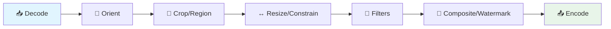

# Zen Pipeline Node Reference

Auto-generated from [zennode](https://github.com/imazen/zennode) schemas.

## Pipeline Flow

## 📊 analysis

| Node | Description | RIAPI Keys |
|------|-------------|------------|
| [Crop Whitespace](nodes/zenpipe-crop_whitespace.md) | Detect and crop uniform borders (whitespace trimming).  Materializes the upstrea | `trim.percentpadding`, `trim.threshold` |
| [Smart Crop Analyze](nodes/zenpipe-smart_crop_analyze.md) | Content-aware smart crop using focus rectangles.  Materializes the upstream imag |  |

## 🔄 auto

| Node | Description | RIAPI Keys |
|------|-------------|------------|
| [Auto Exposure](nodes/zenfilters-auto_exposure.md) | Automatic exposure correction by normalizing to a target middle grey.  Measures  |  |
| [Auto Levels](nodes/zenfilters-auto_levels.md) | Auto levels: stretch the luminance histogram to fill [0, 1].  Scans the L plane  |  |

## 🖼️ canvas

| Node | Description | RIAPI Keys |
|------|-------------|------------|
| [Expand Canvas](nodes/zenlayout-expand_canvas.md) | Expand the canvas by adding padding around the image.  Adds specified pixel amou |  |
| [Fill Rect](nodes/zenpipe-fill_rect.md) | Fill a rectangle with a solid color.  Materializes the upstream image, draws the |  |
| [Round Corners](nodes/zenpipe-round_corners.md) | Apply rounded corners with anti-aliased masking.  Generates a `RoundedRectMask`  | `s.roundcorners` |

## 🎨 color

| Node | Description | RIAPI Keys |
|------|-------------|------------|
| [Bw Mixer](nodes/zenfilters-bw_mixer.md) | Grayscale conversion with per-color luminance weights |  |
| [Camera Calibration](nodes/zenfilters-camera_calibration.md) | Camera calibration -- primary color hue and saturation calibration with shadow t |  |
| [Channel Curves](nodes/zenfilters-channel_curves.md) | Per-channel tone curves applied independently to R, G, B in sRGB space.  Unlike  |  |
| [Color Grading](nodes/zenfilters-color_grading.md) | Three-way split-toning for shadows, midtones, and highlights.  Applies different |  |
| [Color Matrix](nodes/zenfilters-color_matrix.md) | 5x5 color matrix applied in linear RGB space.  Transforms `[R, G, B, A, 1]` -> ` |  |
| [Gamut Expand](nodes/zenfilters-gamut_expand.md) | Hue-selective chroma boost simulating wider color gamuts (P3).  Selectively boos |  |
| [Grayscale](nodes/zenfilters-grayscale.md) | Convert to grayscale by zeroing chroma channels.  In Oklab, grayscale means a=0, | `s.grayscale` |
| [Hsl Adjust](nodes/zenfilters-hsl_adjust.md) | Per-color hue, saturation, and luminance adjustment |  |
| [Hue Rotate](nodes/zenfilters-hue_rotate.md) | Hue rotation in Oklab a/b plane.  Rotates colors around the hue circle by the sp |  |
| [Saturation](nodes/zenfilters-saturation.md) | Uniform chroma scaling on Oklab a/b channels.  Scales chroma by a constant facto | `s.saturation` |
| [Sepia](nodes/zenfilters-sepia.md) | Sepia tone effect in perceptual Oklab space.  Desaturates the image, then applie | `s.sepia` |
| [Temperature](nodes/zenfilters-temperature.md) | Color temperature adjustment (warm/cool) via Oklab b shift.  Positive values war |  |
| [Tint](nodes/zenfilters-tint.md) | Green-magenta tint adjustment via Oklab a shift.  Positive values shift toward m |  |
| [Vibrance](nodes/zenfilters-vibrance.md) | Smart saturation that protects already-saturated colors.  Boosts chroma of low-s |  |
| [Remove Alpha](nodes/zenpipe-remove_alpha.md) | Remove alpha channel by compositing onto a solid matte color.  Produces RGB outp |  |

## 🔲 composite

| Node | Description | RIAPI Keys |
|------|-------------|------------|
| [Composite](nodes/zenpipe-composite.md) | Composite a foreground image onto a background at a position.  Two inputs requir |  |
| [Overlay](nodes/zenpipe-overlay.md) | Overlay a small image (watermark, logo) at absolute coordinates.  Single input ( |  |

## 📥 decode

| Node | Description | RIAPI Keys |
|------|-------------|------------|
| [Decode Heic](nodes/heic-decode.md) | HEIC/HEIF decode node. | `heic.thumbnail`, `heic.depth`, `heic.gain_map`, `heic.mattes` |
| [Decode Jpeg](nodes/zenjpeg-decode.md) | JPEG decoder configuration. | `jpeg.orient`, `jpeg.auto_orient`, `jpeg.max_megapixels`, `jpeg.strictness` |
| [Decode Jxl](nodes/zenjxl-decode.md) | JPEG XL decoder configuration. | `jxl.orient`, `jxl.nits` |
| [Frame Select (RIAPI)](nodes/zenpipe-riapi-frame.md) | Select a specific frame from animated/multi-page images |  |
| [Decode Webp](nodes/zenwebp-decode.md) | WebP decode node. | `webp.dithering`, `webp.dither`, `webp.upsampling` |

## 🔍 detail

| Node | Description | RIAPI Keys |
|------|-------------|------------|
| [Adaptive Sharpen](nodes/zenfilters-adaptive_sharpen.md) | Noise-gated sharpening with detail and masking controls.  Measures local texture |  |
| [Bilateral Filter](nodes/zenfilters-bilateral.md) | Edge-preserving smoothing via guided filter.  Uses a guided filter (He et al., T |  |
| [Blur](nodes/zenfilters-blur.md) | Full-image Gaussian blur across all Oklab channels.  Unlike the L-only blur used |  |
| [Brilliance](nodes/zenfilters-brilliance.md) | Adaptive local contrast based on local average luminance.  Unlike clarity, brill |  |
| [Clarity](nodes/zenfilters-clarity.md) | Multi-scale local contrast enhancement on L channel.  Uses a two-band decomposit |  |
| [Edge Detect](nodes/zenfilters-edge_detect.md) | Edge detection on the L (lightness) channel.  Replaces L with gradient magnitude |  |
| [Median Blur](nodes/zenfilters-median_blur.md) | Median filter for impulse noise removal (preserves edges).  Replaces each pixel  |  |
| [Noise Reduction](nodes/zenfilters-noise_reduction.md) | Wavelet-based luminance and chroma noise reduction.  Uses an a trous wavelet dec |  |
| [Sharpen](nodes/zenfilters-sharpen.md) | Unsharp mask sharpening on L channel.  Like clarity but with a smaller sigma for |  |
| [Texture](nodes/zenfilters-texture.md) | Fine detail contrast enhancement (smaller scale than clarity).  Similar to Clari |  |

## ✨ effects

| Node | Description | RIAPI Keys |
|------|-------------|------------|
| [Alpha](nodes/zenfilters-alpha.md) | Alpha channel scaling for transparency adjustment.  Multiplies all alpha values  | `s.alpha` |
| [Bloom](nodes/zenfilters-bloom.md) | Soft glow from bright areas via screen blending.  Extracts pixels above a lumina |  |
| [Chromatic Aberration](nodes/zenfilters-chromatic_aberration.md) | Lateral chromatic aberration correction.  Corrects color fringing at image edges |  |
| [Dehaze](nodes/zenfilters-dehaze.md) | Spatially-adaptive haze removal using dark channel prior.  Uses a dark channel p |  |
| [Devignette](nodes/zenfilters-devignette.md) | Lens vignetting correction (devignette).  Compensates for the natural light fall |  |
| [Grain](nodes/zenfilters-grain.md) | Film grain simulation with luminance-adaptive response.  Adds synthetic grain to |  |
| [Invert](nodes/zenfilters-invert.md) | Color inversion in Oklab space.  Inverts lightness (L' = 1.0 - L) and negates ch | `s.invert` |
| [Vignette](nodes/zenfilters-vignette.md) | Post-crop vignette: darken or lighten image edges.  Applies a radial falloff fro |  |

## 📤 encode

| Node | Description | RIAPI Keys |
|------|-------------|------------|
| [Avif Encode](nodes/zenavif-encode.md) | AVIF encoding node. | `avif.alpha_color_mode`, `avif.alpha_mode`, `avif.alpha_quality`, `avif.aq` +7 |
| [Encode Bmp](nodes/zenbitmaps-encode_bmp.md) | BMP encoding with bit depth selection. | `bmp.bits`, `bits` |
| [Quality Intent Node](nodes/zencodecs-quality_intent.md) | Format selection and quality profile for encoding (zennode node).  This node con | `accept.avif`, `accept.color_profiles`, `accept.jxl`, `accept.webp` +9 |
| [Encode Gif](nodes/zengif-encode.md) | GIF encoder settings. | `gif.dithering`, `gif.dither`, `gif.loop`, `gif.lossy` +6 |
| [Encode Jpeg](nodes/zenjpeg-encode.md) | JPEG encoder configuration as a self-documenting pipeline node.  Schema-only def | `jpeg.aq`, `jpeg.chroma_method`, `jpeg.colorspace`, `jpeg.deringing` +8 |
| [Encode Mozjpeg](nodes/zenjpeg-encode_mozjpeg.md) | Mozjpeg-compatible JPEG encoder configuration. | `mozjpeg.effort`, `mozjpeg.quality`, `mozjpeg.q`, `mozjpeg.subsampling` +1 |
| [Encode Jxl](nodes/zenjxl-encode.md) | JPEG XL encoder configuration. | `jxl.distance`, `jxl.d`, `jxl.effort`, `jxl.e` +4 |
| [Encode Png](nodes/zenpng-encode.md) | PNG encoding with quality, lossless mode, and compression options. | `png.effort`, `png.lossless`, `png.max_deflate`, `png.min_quality` +1 |
| [Encode Tiff](nodes/zentiff-encode.md) | TIFF encoding with compression and predictor options. | `tiff.big_tiff`, `tiff.compression`, `tiff.predictor` |
| [Encode Webp Lossless](nodes/zenwebp-encode_lossless.md) | WebP lossless (VP8L) encode node. | `webp.alpha_quality`, `webp.aq`, `webp.effort`, `webp.exact` +4 |
| [Encode Webp Lossy](nodes/zenwebp-encode_lossy.md) | WebP lossy (VP8) encode node. | `webp.alpha_quality`, `webp.aq`, `webp.effort`, `webp.sharpness` +9 |

## 📐 geometry

| Node | Description | RIAPI Keys |
|------|-------------|------------|
| [Crop](nodes/zenlayout-crop.md) | Crop the image to a pixel rectangle.  Specifies origin (x, y) and dimensions (w, |  |
| [Crop Margins](nodes/zenlayout-crop_margins.md) | Crop the image by removing percentage-based margins from each side.  Each value  |  |
| [Crop Percent](nodes/zenlayout-crop_percent.md) | Crop the image using percentage-based coordinates.  All coordinates are fraction |  |
| [Flip H](nodes/zenlayout-flip_h.md) | Flip the image horizontally (mirror left-right).  No parameters. Presence in the |  |
| [Flip V](nodes/zenlayout-flip_v.md) | Flip the image vertically (mirror top-bottom).  No parameters. Presence in the p |  |
| [Orient](nodes/zenlayout-orient.md) | Apply EXIF orientation correction.  Orientation values 1-8 follow the EXIF stand | `srotate` |
| [Region Viewport](nodes/zenlayout-region.md) | Viewport into the source image, unifying crop and pad.  Defines a rectangular wi |  |
| [Rotate180](nodes/zenlayout-rotate_180.md) | Rotate the image 180 degrees.  Decomposes to flip-H + flip-V (no axis swap), so  |  |
| [Rotate270](nodes/zenlayout-rotate_270.md) | Rotate the image 270 degrees clockwise (90 counter-clockwise).  Swaps width and  |  |
| [Rotate90](nodes/zenlayout-rotate_90.md) | Rotate the image 90 degrees clockwise.  Swaps width and height. Coalesced with o |  |
| [Auto-Rotate (RIAPI)](nodes/zenpipe-riapi-autorotate.md) | Apply EXIF orientation correction via querystring |  |
| [Crop (RIAPI)](nodes/zenpipe-riapi-crop.md) | Crop image to rectangle via querystring coordinates |  |
| [Flip (RIAPI)](nodes/zenpipe-riapi-flip.md) | Flip image horizontally and/or vertically via querystring |  |
| [Rotate (RIAPI)](nodes/zenpipe-riapi-rotate.md) | Rotate image by 90/180/270 degrees via querystring |  |
| [Constrain](nodes/zenresize-constrain.md) | Constrain image dimensions with resize, crop, or pad modes.  The unified resize/ | `bgcolor`, `canvas_color`, `down.filter`, `anchor` +23 |
| [Resize](nodes/zenresize-resize.md) | Forced resize to exact dimensions (no layout planning).  Unlike [`Constrain`] wh |  |

## 📏 layout

| Node | Description | RIAPI Keys |
|------|-------------|------------|
| [Output Limits](nodes/zenlayout-output_limits.md) | Safety limits and codec alignment for output dimensions.  Constrains the final o |  |

## 🎯 quantize

| Node | Description | RIAPI Keys |
|------|-------------|------------|
| [Quantize](nodes/zenquant-quantize.md) | Palette quantization with perceptual masking. | `quant.dither_strength`, `dither_strength`, `quant.max_colors`, `max_colors` +1 |

## ☀️ tone

| Node | Description | RIAPI Keys |
|------|-------------|------------|
| [Contrast](nodes/zenfilters-contrast.md) | Power-curve contrast adjustment pivoted at middle grey.  Uses a power curve that | `s.contrast` |
| [Exposure](nodes/zenfilters-exposure.md) | Exposure adjustment in photographic stops.  +1 stop doubles linear light, -1 hal | `s.brightness` |
| [Fused Adjust](nodes/zenfilters-fused_adjust.md) | Fused per-pixel adjustment: applies all per-pixel operations in a single pass ov |  |
| [Parametric Curve](nodes/zenfilters-parametric_curve.md) | Parametric tone curve with 4 zone controls and 3 movable dividers.  Zone-based c |  |
| [Sigmoid](nodes/zenfilters-sigmoid.md) | S-curve tone mapping with skew and chroma compression.  Uses the generalized sig |  |
| [Tone Curve](nodes/zenfilters-tone_curve.md) | Arbitrary tone curve via control points with cubic spline interpolation  Control |  |

## ⚙️ tone_map

| Node | Description | RIAPI Keys |
|------|-------------|------------|
| [Basecurve Tone Map](nodes/zenfilters-basecurve_tonemap.md) | Camera-matched basecurve tone mapping from darktable presets |  |
| [DtSigmoid](nodes/zenfilters-dt_sigmoid.md) | darktable-compatible sigmoid tone mapper.  Implements the generalized log-logist |  |
| [Levels](nodes/zenfilters-levels.md) | Input/output range remapping with gamma correction.  The classic Photoshop/Light |  |

## ⚙️ tone_range

| Node | Description | RIAPI Keys |
|------|-------------|------------|
| [Black Point](nodes/zenfilters-black_point.md) | Black point adjustment on Oklab L channel.  Remaps the shadow floor. A black poi |  |
| [Highlight Recovery](nodes/zenfilters-highlight_recovery.md) | Automatic soft-clip recovery for blown highlights.  Analyzes the L histogram to  |  |
| [Highlights / Shadows](nodes/zenfilters-highlights_shadows.md) | Targeted highlight recovery and shadow lift.  Positive highlights compresses bri |  |
| [Local Tone Map](nodes/zenfilters-local_tone_map.md) | Local tone mapping: compresses dynamic range while preserving local contrast.  S |  |
| [Shadow Lift](nodes/zenfilters-shadow_lift.md) | Automatic toe-curve recovery for crushed shadows.  Analyzes the L histogram to d |  |
| [Tone Equalizer](nodes/zenfilters-tone_equalizer.md) | Zone-based luminance adjustment with edge-aware masking.  Divides the luminance  |  |
| [White Point](nodes/zenfilters-white_point.md) | White point adjustment on Oklab L channel.  Scales the L range so that `level` m |  |
| [Whites / Blacks](nodes/zenfilters-whites_blacks.md) | Whites and Blacks adjustment -- targeted luminance control for the extreme ends  |  |
